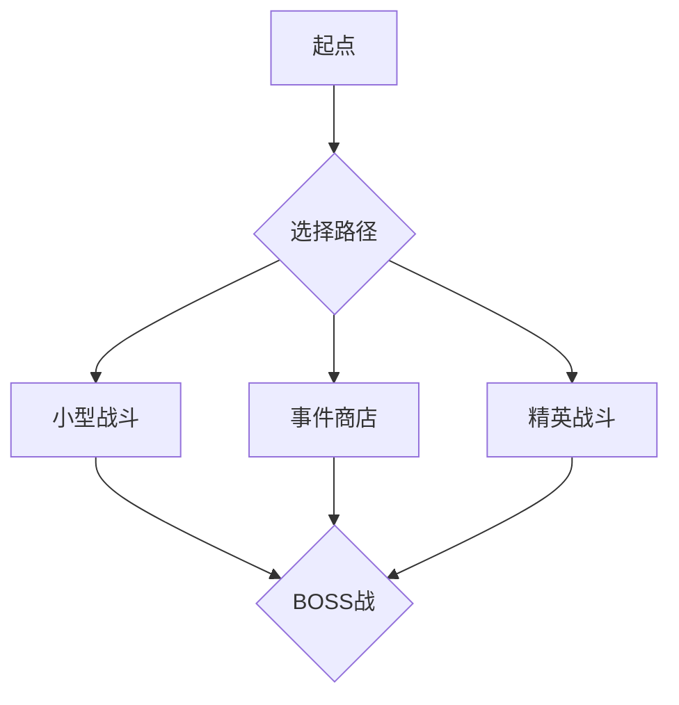

# 竞品分析 & 优化方案

## 一、竞品定位

### 市场格局（2025-2026）

| 竞品 | 类型 | 单局时长 | F2P友好度 | 特点 | 年收入(估) |
|------|------|---------|-----------|------|-----------|
| Hearthstone | 硬核CCG | 8-12min | ★★★ | 标准制定者 | $200M+ |
| Marvel Snap | 轻量CCG | 3-5min | ★★★★ | 快节奏+收藏驱动 | $100M+ |
| LoR | 技艺CCG | 10-15min | ★★★★★ | 最慷慨+PVE模式 | $50M+ |
| Shadowverse | 日系CCG | 8-12min | ★★★ | 日本+Asia专属 | $80M+ |
| Gwent | 策略CCG | 8-12min | ★★★★ | 回合制博弈 | $20M+ |

### 本项目定位

```
题材: 战国×诸子百家 → 无直接竞品（唯一）
目标用户: 港台+东南亚华人 → niche但有付费意愿
核心竞争策略: 不做Hearthstone杀手，做"Chinese Lore CCG"品类开创者
```

---

## 二、全方位差距分析（由高到低优先级）

### 🔴 P0 - 核心功能缺陷（阻止留存的最严重问题）

| # | 差距 | 竞品基准 | 本项目现状 |
|---|------|---------|----------|
| 1 | **不出法术牌** | AI会使用所有类型卡牌 | AI硬编码只打出随从，法术/武器完全忽略 |
| 2 | **英雄技能无效** | 所有竞品英雄技能正常生效 | 仅扣法力，无效果执行 |
| 3 | **风怒无限攻击** | 无此bug | 重置攻击状态遗漏`hasUsedFirstWindfuryAttack` |
| 4 | **消灭不触发亡语** | 亡语是核心机制 | 直接从board移除，漏调`handleDeath` |
| 5 | **亡语不在回合结束触发** | 标准CCG机制 | 空注释占位 |
| 6 | **无伤害动画/死亡动画** | 每张卡有完整死亡+伤害反馈 | BoardCard的dying动画从未触发，伤害Overlay完整实现但未集成 |

**结论：以上6项让游戏在核心玩法的"正确性"上不合格，玩家开局就会遇到Bug。必须在任何竞争优化之前修完。**

### 🟠 P1 - 用户体验差距（决定7日留存的关键）

| # | 差距 | 竞品基准 | 本项目现状 |
|---|------|---------|----------|
| 7 | **无新手教程** | 所有竞品都有引导→教学关 | 零引导，玩家打开游戏后不知做什么 |
| 8 | **无每日任务** | Hearthstone每日/周任务 → 核心日留存 | 无任何任务系统 |
| 9 | **无成就系统** | 里程碑驱动长期目标感 | 无 |
| 10 | **卡牌查看/详情** | 长按卡牌弹出大图+词条解释 | 无（CollectionScreen有极简弹窗） |
| 11 | **无战斗日志** | 查看历史操作记录 | 只有debugprint |
| 12 | **无Card Back/自定义** | 基础个性化 | 无 |
| 13 | **无段位/天梯** | 竞争驱动力 | Leaderboard页面空占位 |

### 🔴 P2 - 玩法深度差距（决定长期留存/LTV）

| # | 差距 | 竞品基准 | 本项目现状 |
|---|------|---------|----------|
| 14 | **冒险模式过于线性** | LoR有Path of Champions（roguelite），Hearthstone有佣兵战纪 | 30个固定关卡，一次通关后无重复可玩性 |
| 15 | **无卡牌合成/分解** | 标准dusting系统 | 无任何回收/合成机制 |
| 16 | **无组合/连击系统** | 卡牌间协同效应 | ComboSystem已实现但未被任何代码调用 |
| 17 | **无升级系统** | 提升卡牌品质 | UpgradeSystem已建模但未接入 |
| 18 | **无阵营协同** | 同阵营卡牌有加成 | 仅有`CardOwner`标签，无游戏内效果绑定 |
| 19 | **无牌库构成策略** | 没有检索/滤抽/复制/洗牌等牌库交互 | 仅有基础抽牌 |

### 🟠 P3 - 货币化差距（决定收入）

| # | 差距 | 标杆 | 现状 |
|---|------|------|------|
| 20 | **无内购** | $0.99 starter pack在95%的F2P游戏中是转化率最高的付费点 | 未实现（RevenueCat框架待接入） |
| 21 | **无Battle Pass** | 最稳定的月流水来源（$4.99-$9.99/月） | 无 |
| 22 | **无激励广告** | 免费给金币/开包/复活 → 广告收入+降低付费门槛 | 代码中有文案和接口，无实质接入 |
| 23 | **无限时活动** | 每周/每月限定内容，制造紧迫感 | 无 |
| 24 | **无首充奖励** | 首充送稀有卡 → 极高转化率 | 无 |
| 25 | **无体力/能量系统** | 控制玩家消费节奏 | 无限畅玩（对留存是双刃剑） |

### 🟡 P4 - 技术&品质差距（决定口碑）

| # | 差距 | 标杆 | 现状 |
|---|------|------|------|
| 26 | **卡牌图片全部缺失** | 有完整游戏内卡面 | assets目录仅声明，无一实际文件 |
| 27 | **无音效/配乐** | BGM+SFX全覆盖 | AudioManager完整实现但0处调用，sound目录空 |
| 28 | **UI无入场动画** | 流畅的卡片入手飞舞动画 | HandCard动画controller从未forward |
| 29 | **App Icon/商店素材** | 有吸引力的icon和截屏 | 默认Flutter icon |

---

## 三、超越竞品的核心策略

基于项目的独特资源（中国战国题材 + 单人开发 + 目标niche市场），最关键的策略并非模仿Hearthstone，而是差异化：

### 策略1：🇨🇳 文化深度 = 不可复制的护城河

竞品做不到的：
- **真实历史人物+事件**：孙武、商鞅、韩非子——不只是卡牌名字，每张卡附带典故（flavor text已有）
- **动态势力关系**：合纵连横——阵营之间可以"结盟"或"背叛"，这是游戏机制
- **学派思想对决**：兵家vs儒家、道家vs法家——不只是卡牌标签，是玩法核心

**操作建议**：做"历史之旅"专题活动，每周解锁一个学派/时期/战役。这既是有差异化的内容，也是持续的运营抓手。

### 策略2：🎮 单机Roguelite冒险 = 无限可玩性

**这是在本游戏框架上最具影响力的改动**：

当前：30关固定冒险 → 一次通关，不再打开
改为：**Rogue-like路径选择**（类似Slay the Spire）



收益：
- 同样的30关 → 300种不同路径组合
- 每次冒险结果不同 → 无限重玩
- 可加入"本次冒险的临时卡牌"/"升级" → 让玩家觉得每局不一样
- 不需要新增任何美术资源，只改关卡选择逻辑

### 策略3：💰 混合变现 = 最佳ROI

单人开发的最大瓶颈是收入。混合变现（IAP + Ads）是已知的最佳方案：

**广告层**（P0，立即接入）：
- 主界面底部横幅（不干扰游戏）
- 每局结束后激励视频：双倍金币
- 冒险失败后激励视频：复活
- 每日免费开包（看广告替代金开）

**付费层**（P1，RevenueCat上线时）：
- $0.99 新手礼包 → 转化率最高产品
- $4.99 Battle Pass → 月流水主力
- 金币包 ($1.99/$4.99/$9.99)

**留存循环**（P2，内容运营）：
```
每日任务 → 获得金币 → 开包/买Pass → 更强卡组 → 更多胜利 → 成就感
        ↘ 完成周任务 → 稀有奖励 → 炫耀/收集欲望 → 继续玩
```

### 策略4：⚡ 快节奏优化 = 碎片时间

Marvel Snap的成功证明了缩短局时对移动端留存的重要性：

| 改动 | 效果 |
|------|------|
| 回合倒计时从20s → 15s | 局时缩短→更高回访率 |
| 跳过等待动画（设置） | 减少烦躁 |
| 快速模式（3分钟/局） | 碎片时间场景 |
| 自动加速（连续Pass时加速） | 节奏更紧凑 |

---

## 四、按优先级排序的可执行任务清单

### P0 立即修复（1-2周）
```
☐ AI出法术牌 + 英雄技能
☐ 风怒Bug
☐ 亡语触发（消灭+回合结束）
☐ 死亡动画 + 伤害数字Overlay
☐ 集成 AdMob激励视频（开包/复活/双倍金币）
```

### P1 用户体验（2-4周）
```
☐ 新手教学关卡（3关引导：基础/技能/策略）
☐ 每日任务系统（3个简单任务 + 刷新）
☐ 基础成就系统（10个里程碑成就）
☐ 卡牌详情长按查看
☐ 战斗日志
☐ 集成 RevenueCat（去广告+金币包+新手礼包）
```

### P2 玩法深度（4-8周）
```
☐ Roguelite冒险模式（路径选择 + 临时升级）
☐ 卡牌合成/分解系统
☐ 阵营协同效果（同阵营增益）
☐ 组合系统正式接入
☐ Battle Pass（免费轨道 + 付费轨道）
```

### P3 品质提升（持续）
```
☐ 卡牌图片资源补齐
☐ 音效/配乐
☐ 卡牌入手动画
☐ Card Back自定义
☐ 商店 icon/截屏素材
```

---

## 五、关键决策：做"小而美"还是"大而全"？

**建议：做"小而美"的深度CCG。**

- **不做**：天梯排名、实时对战、多人在线、公会系统
- **专注做**：单机Roguelite冒险、收集养成、文化沉浸感

为什么：
1. 实时对战需要服务器成本+匹配系统+反作弊 → 单人项目不可行
2. 港澳台+东南亚华人市场 ≈ 5000万潜在用户，但**核心玩家**不到50万
3. 50万核心玩家 × 中等ARPU ($2/月) = $100万/年 → 足以支撑单人开发
4. 文化深度是**唯一**Hearthstone/Marvel Snap做不了的差异化

### 一句话战略：
> **"做全世界唯一一款战国诸子百家题材的Roguelite CCG，让目标用户觉得这是为他们做的游戏。"**
